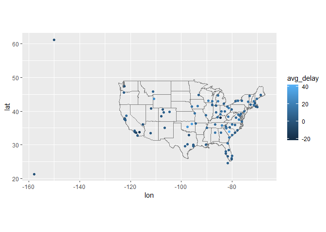
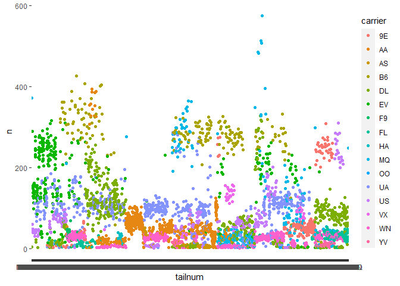
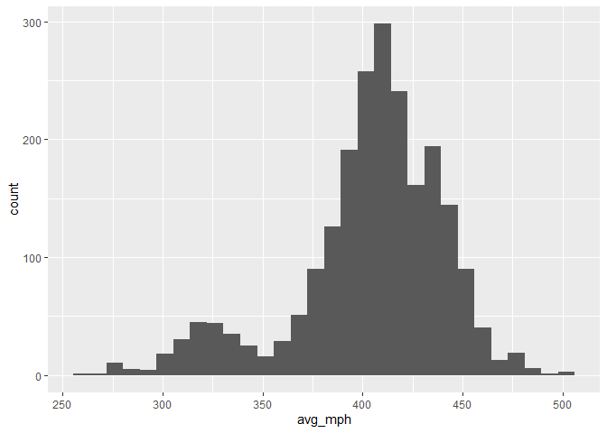

practice midterm
================
madison dunn

## Midterm.

#### 1\. Map the delay by destination.

Compute the average delay by destination, then join on the airports data
frame so you can show the spatial distribution of delays. Here’s an
easy way to draw a map of the United States. You are welcome to use this
code or some other code.

You might want to use the size or colour of the points to display the
average delay for each
    airport.

``` r
library(tidyverse)
```

    ## Warning: package 'tidyverse' was built under R version 4.0.5

    ## -- Attaching packages --------------------------------------- tidyverse 1.3.1 --

    ## v ggplot2 3.3.3     v purrr   0.3.4
    ## v tibble  3.1.0     v dplyr   1.0.5
    ## v tidyr   1.1.3     v stringr 1.4.0
    ## v readr   2.0.1     v forcats 0.5.1

    ## Warning: package 'tidyr' was built under R version 4.0.5

    ## Warning: package 'readr' was built under R version 4.0.5

    ## -- Conflicts ------------------------------------------ tidyverse_conflicts() --
    ## x dplyr::filter() masks stats::filter()
    ## x dplyr::lag()    masks stats::lag()

``` r
library(nycflights13)
```

    ## Warning: package 'nycflights13' was built under R version 4.0.5

``` r
flights %>%
  group_by(dest) %>% 
  summarise(
    avg_delay=mean(arr_delay, na.rm=T)) %>% 
  left_join(airports, c("dest" = "faa"))%>% 
  ggplot(aes(lon, lat)) +
  borders("state") +
  geom_point(aes(col=avg_delay)) +
  coord_quickmap() 
```

    ## Warning: Removed 4 rows containing missing values (geom_point).

<!-- -->

#### 2\. Do planes trade ownership?

You might expect that there’s an implicit relationship between plane and
airline, because each plane is flown by a single airline. Explore this
conjecture using data. (Let’s assume that the tail number of a plane
does not change.)

``` r
flights_1 = flights %>% 
  filter(!is.na(tailnum)) %>% 
  group_by(tailnum,carrier) %>% 
  summarise(n=n()) %>% 
  filter(n>1) %>% 
  print(n=6)
```

    ## `summarise()` has grouped output by 'tailnum'. You can override using the `.groups` argument.

    ## # A tibble: 3,889 x 3
    ## # Groups:   tailnum [3,872]
    ##   tailnum carrier     n
    ##   <chr>   <chr>   <int>
    ## 1 D942DN  DL          4
    ## 2 N0EGMQ  MQ        371
    ## 3 N10156  EV        153
    ## 4 N102UW  US         48
    ## 5 N103US  US         46
    ## 6 N104UW  US         47
    ## # ... with 3,883 more rows

``` r
ggplot(flights_1,aes(x=tailnum,y=n,col=carrier))+
  geom_jitter()
```

<!-- -->

#### 3a. Plane’s average speed.

Notice that `flights$air_time` is in minutes. Make a new column that is
the air time in hours.

``` r
flights %>% 
  group_by(air_time) %>% 
  mutate(
    flights_airtime_hours = (air_time/60)) %>% 
  select(flights_airtime_hours,year,month,day, air_time)
```

    ## # A tibble: 336,776 x 5
    ## # Groups:   air_time [510]
    ##    flights_airtime_hours  year month   day air_time
    ##                    <dbl> <int> <int> <int>    <dbl>
    ##  1                 3.78   2013     1     1      227
    ##  2                 3.78   2013     1     1      227
    ##  3                 2.67   2013     1     1      160
    ##  4                 3.05   2013     1     1      183
    ##  5                 1.93   2013     1     1      116
    ##  6                 2.5    2013     1     1      150
    ##  7                 2.63   2013     1     1      158
    ##  8                 0.883  2013     1     1       53
    ##  9                 2.33   2013     1     1      140
    ## 10                 2.3    2013     1     1      138
    ## # ... with 336,766 more rows

#### 4b. Average speed

For each flight, compute the average speed of that flight (in miles per
hour). Then, for each plane, compute the average of those average
speeds. Display it in a histogram. You can use a base R histogram `hist`
or ggplot’s `geom_histogram`.

``` r
library(ggplot2)
flights %>%
  group_by(tailnum) %>% 
    mutate(mph = distance/(air_time /60)) %>% 
    summarise(avg_mph=mean(mph)) %>% 
  ggplot(aes(x = avg_mph)) + 
  geom_histogram()
```

    ## `stat_bin()` using `bins = 30`. Pick better value with `binwidth`.

    ## Warning: Removed 1855 rows containing non-finite values (stat_bin).

<!-- -->

#### 5\. Bonus

Make a table where each row is a destination, each column is a carrier,
and each element is the number of times that the carrier has flown to
that destination. Ensure that you only count flights that arrived at the
destination.

``` r
flights %>% 
  filter(!is.na(arr_time)) %>% 
  group_by(carrier, dest) %>% 
  summarize(n=n()) %>% 
  pivot_wider(names_from=carrier,values_from=n,values_fill=0)
```

    ## `summarise()` has grouped output by 'carrier'. You can override using the `.groups` argument.

    ## # A tibble: 104 x 17
    ##    dest   `9E`    AA    AS    B6    DL    EV    F9    FL    HA    MQ    OO    UA
    ##    <chr> <int> <int> <int> <int> <int> <int> <int> <int> <int> <int> <int> <int>
    ##  1 ATL      56     0     0     0 10476  1660     0  2284     0  2237     0   102
    ##  2 AUS       2   359     0   744   353     0     0     0     0     0     0   664
    ##  3 AVL      10     0     0     0     0   253     0     0     0     0     0     0
    ##  4 BNA     452     0     0     0     1  2059     0     0     0  2306     0     0
    ##  5 BOS     853  1430     0  4326   962   156     0     0     0     0     0  3299
    ##  6 BTV       2     0     0  1348     0  1162     0     0     0     0     0     0
    ##  7 BUF     790     0     0  2773     3  1005     0     0     0     0     0     0
    ##  8 BWI     816     0     0     0     0   339     0     0     0   333     0     0
    ##  9 CAE       3     0     0     0     0   103     0     0     0     0     0     0
    ## 10 CHS     332     0     0   612     0  1825     0     0     0     0     0     1
    ## # ... with 94 more rows, and 4 more variables: US <int>, VX <int>, WN <int>,
    ## #   YV <int>
